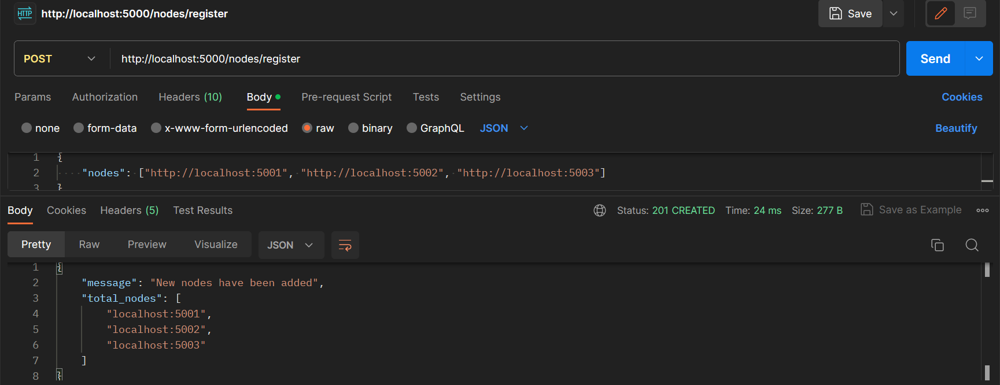
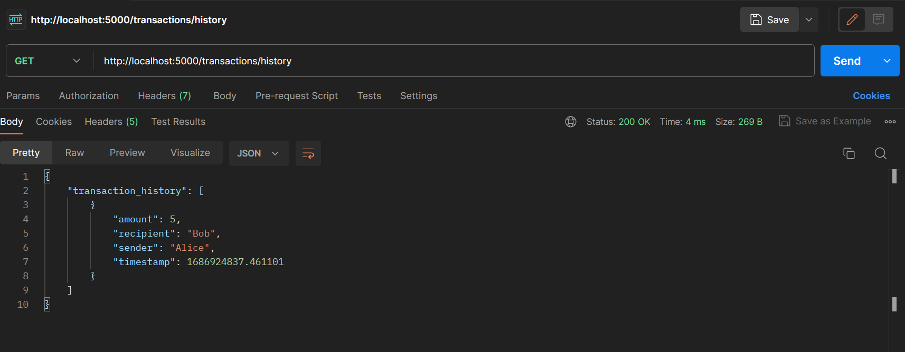

# Blockchain

This project implements a basic blockchain using Python and Flask. It allows users to create transactions, mine new blocks, and maintain a decentralized ledger.

## Functionality

The blockchain provides the following functionality:

- **Mining:** Users can mine new blocks by running the `/mine` endpoint. This involves running a proof-of-work algorithm to find the next valid proof and adding the block to the chain.

- **Transactions:** Users can create new transactions by making a POST request to the `/transactions/new` endpoint. The transaction must include the sender, recipient, and amount. These transactions will be included in the next mined block.

- **Chain:** Users can retrieve the full blockchain by making a GET request to the `/chain` endpoint. This returns the complete chain and its length.

- **Nodes:** Users can register new nodes in the network by making a POST request to the `/nodes/register` endpoint. The request must include a list of nodes to be registered. This helps in maintaining a decentralized network.

- **Consensus:** Users can resolve conflicts and reach consensus among nodes by making a GET request to the `/nodes/resolve` endpoint. This ensures that all nodes have the same valid chain.

- **History:** Users can retrieve the transaction history by making a GET request to the `/history` endpoint. This returns the complete history log of transactions.

## Installation

To run the project, make sure you have Python 3.8 or higher installed. Follow these steps:

1. Clone the repository: `git clone https://github.com/arinaptr/Blockchain`
2. Navigate to the project directory: `cd project-directory`


## Usage

1. Start the application: `python blockchain.py`
2. The blockchain server will be accessible at `http://localhost:5000`.
3. Use an API client like Postman to interact with the blockchain endpoints.


## Mining

To mine a new block, send a GET request to `http://localhost:5000/mine`. 
This will add a new block to the chain and return information about the mined block.


## Creating Transactions

To create a new transaction, send a POST request to `http://localhost:5000/transactions/new`. 
The request body should include the following JSON payload:

```json
{
    "sender": "sender-address",
    "recipient": "recipient-address",
    "amount": 10
}
```

Replace "sender-address" with the address of the transaction sender.
Replace "recipient-address" with the address of the transaction recipient.
Replace "amount" with the amount of the transaction.


The response will indicate the index of the block that will hold the transaction.


## Retrieving the Blockchain

To retrieve the full blockchain, send a GET request to `http://localhost:5000/chain`.
This will return the complete chain and its length.


## Registering Nodes

To register new nodes in the network, send a POST request to `http://localhost:5000/nodes/register`.
The request body should include the following JSON payload:

```json
{
    "nodes": ["node1", "node2", "node3"]
}
```

Replace "node1", "node2", "node3" with the addresses of the nodes to be registered.




## Resolving Conflicts

To resolve conflicts and reach consensus among nodes, send a GET request to `http://localhost:5000/nodes/resolve`.
This will ensure that all nodes have the same valid chain.


## Retrieving Transaction History

To retrieve the transaction history, send a GET request to `http://localhost:5000/history`.
This will return the complete history log of transactions.


